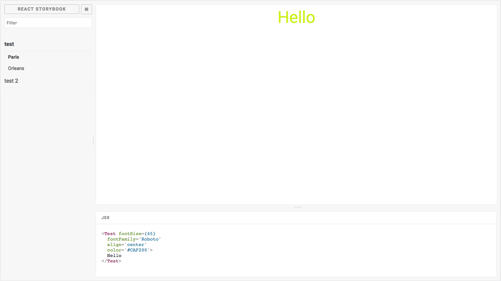

<p align="center">
  
  <br>
  <h1 style="text-align:center;">Storybook-addon-jsx</h1>
</p>

[](https://travis-ci.org/Kilix/storybook-addon-jsx)
[](https://www.npmjs.com/package/storybook-addon-jsx)
[](https://www.npmjs.com/package/storybook-addon-jsx)

This Storybook addon shows you the JSX of the story.
This preview works for Vue components as well.
The outputted JSX will reflect any changes made to the storybok by knobs or controls.



## Getting started

### Installation

First install the addon from `npm`:

```sh
npm i --save-dev storybook-addon-jsx
# or
yarn add --dev storybook-addon-jsx
```

### Configuration

For the latest storybook all you need to do is add the addon to your `.storybook/main.js`:

```js
module.exports = {
  addons: ['storybook-addon-jsx']
};
```

If you are using storybook@5.x or lower you will need to add the following to `.storybook/addons.js`:

```js
import 'storybook-addon-jsx/register';
```

### Usage

Import it into your stories file and then use it when you write stories:

```js
import React from "react";
import { storiesOf } from "@storybook/react";
import { jsxDecorator } from "storybook-addon-jsx";

import { TestComponent } from './TestComponent':

export default {
  title: "Components/TestComponent",
  decorators: [jsxDecorator],
};

export const Paris = () => (
  <TestComponent fontSize={45} fontFamily="Roboto" align="center" color="#CAF200">
    Hello
  </TestComponent>
);

export const Orleans = () => <Test color="#236544">Hello</Test>;
```

Or to configure it globally add the `jsxDecorator` to your `.storybook/preview.js`:

```js
const { addDecorator } = require('@storybook/react');
const { jsxDecorator } = require('storybook-addon-jsx');

addDecorator(jsxDecorator);
```

#### Vue

You can also use this addon with `@storybook/vue`.

**`.storybook/preview.js`**

```js
import { configure, addDecorator } from '@storybook/vue';
import { jsxDecorator } from 'storybook-addon-jsx';

addDecorator(jsxDecorator);
```

If a Vue story defines its view with a template string then it will be displayed.

```js
import { storiesOf } from '@storybook/vue';

storiesOf('Vue', module).add('template property', () => ({
  template: `<div></div>`
}));
```

## Options

### JSX

This addon support all options from [react-element-to-jsx-string](https://github.com/algolia/react-element-to-jsx-string) as well as the following options.

- `skip` (default: 0) : Skip element in your component to display

```javascript
export default {
  title: 'Components/TestComponent',
  parameters: {
    jsx: { skip: 1 }
  }
};
```

- `onBeforeRender(domString: string) => string` (default: undefined) : function that receives the dom as a string before render.

```js
export default {
  title: 'Components/TestComponent',
  parameters: {
    jsx: {
      onBeforeRender: domString => {
        if (domString.search('dangerouslySetInnerHTML') < 0) {
          return '';
        }

        try {
          domString = /(dangerouslySetInnerHTML={{)([^}}]*)/.exec(domString)[2];
          domString = /(')([^']*)/.exec(domString)[2];
        } catch (err) {}

        return domString;
      }
    }
  }
};
```

- `displayName` (default: 0) : You can manually name the components that use useMemo or useRef.

```javascript
export default {
  title: 'Components/TestComponent',
  parameters: {
    jsx: {
      displayName: () => 'CustomName'
    }
  }
};
```

### Disable JSX Addon

If enabled globally, the JSX addon can be disabled on individual stories:

```jsx
export const Simple = () => <div>Hello</div>;

Simple.story = {
  parameters: {
    jsx: {
      disable: true
    }
  }
};
```

### Vue Options

- `enableBeautify` (default: true) : Beautify the template string
- All HTML options from [js-beautify](https://github.com/beautify-web/js-beautify#css--html)

## Global Options

To configure global options for this plugin, add the following to your `config.js`.

```js
import { addParameters } from '@storybook/react';

addParameters({
  jsx: {
    // your options
  }
});
```

## Function Props

If you provide a funtion to one of your props `storybook-addon-jsx` will display that functions `toString` result.
This is usaully very ugly.
To override this include the following util function that will print an easiy to read string.

```tsx
/**
 * Overrides the toString on a function so that it addon-jsx prints
 * the callbacks in a copy-paste-able way.
 */
export const callback = <T extends Function>(fn: T): T => {
  /** A toString to render the function in storybook */
  // eslint-disable-next-line no-param-reassign
  fn.toString = () => '() => {}';
  return fn;
};
```

This works well with the `@storybook/addon-actions` too.

```tsx
export ExampleStory = () => (
  <TestComponent onClick={callback(action('onClick'))} />
)
```

## Including DocGen Information

This addon will display prop type information while hovering over a component or prop.
This is accomplished through [a babel plugin](https://github.com/storybookjs/babel-plugin-react-docgen) in the default storybook configuration.
To use the docgen information for TypeScript components you must include be using [a typescript docgen loader](https://github.com/strothj/react-docgen-typescript-loader)

```js
import { addParameters } from '@storybook/react';

addParameters({
  jsx: {
    // your options
  }
});
```

### TypeScript Monorepo DocGen

In a TypeScript monorepo you will probably be importing components through package names.
In this situation storybook will load your compiled typescript and lose information about the props.

One solution to get around this is to add a unique property to your component's `package.json` that points directly at the TypeScript source.
We can then set storybook's webpack configuration to look for this property first, which will allow the TypeScript loader to insert docgen information.

In your component's `package.json`:

```jsonc
{
  // Can be any string you want, here we choose "source"
  "source": "src/index.tsx"
}
```

Then in your webpack config for storybook:

```js
config.resolve.mainFields = ['source', 'module', 'main'];
```

## Testing with storyshots

If you are using the `addWithJSX` method you will need to include `storybook-addon-jsx` in your test file.

```js
import initStoryshots from '@storybook/addon-storyshots';
import { setAddon } from '@storybook/react';
import JSXAddon from 'storybook-addon-jsx';

setAddon(JSXAddon);

initStoryshots({
  /* configuration options */
});
```

## Usage with IE11

Some of the dependencies that this package has use APIs not available in IE11.
To get around this you can add the following to your `webpack.config.js` file
(your paths might be slightly different):

```js
config.module.rules.push({
  test: /\.js/,
  include: path.resolve(__dirname, '../node_modules/stringify-object'),
  use: [
    {
      loader: 'babel-loader',
      options: {
        presets: ['env']
      }
    }
  ]
});
```

## Contributors ✨

Thanks goes to these wonderful people ([emoji key](https://allcontributors.org/docs/en/emoji-key)):

<!-- ALL-CONTRIBUTORS-LIST:START - Do not remove or modify this section -->
<!-- prettier-ignore-start -->
<!-- markdownlint-disable -->
<table>
  <tr>
    <td align="center"><a href="https://wcastand.tech/"><br /><sub><b>William</b></sub></a><br /><a href="https://github.com/storybookjs/addon-jsx/commits?author=wcastand" title="Code">💻</a> <a href="#design-wcastand" title="Design">🎨</a> <a href="#ideas-wcastand" title="Ideas, Planning, & Feedback">🤔</a> <a href="https://github.com/storybookjs/addon-jsx/commits?author=wcastand" title="Documentation">📖</a></td>
    <td align="center"><a href="http://hipstersmoothie.com"><br /><sub><b>Andrew Lisowski</b></sub></a><br /><a href="https://github.com/storybookjs/addon-jsx/commits?author=hipstersmoothie" title="Code">💻</a> <a href="https://github.com/storybookjs/addon-jsx/commits?author=hipstersmoothie" title="Documentation">📖</a> <a href="#infra-hipstersmoothie" title="Infrastructure (Hosting, Build-Tools, etc)">🚇</a> <a href="#maintenance-hipstersmoothie" title="Maintenance">🚧</a></td>
    <td align="center"><a href="https://github.com/ndelangen"><br /><sub><b>Norbert de Langen</b></sub></a><br /><a href="https://github.com/storybookjs/addon-jsx/commits?author=ndelangen" title="Code">💻</a> <a href="https://github.com/storybookjs/addon-jsx/commits?author=ndelangen" title="Documentation">📖</a></td>
    <td align="center"><a href="https://github.com/samouss"><br /><sub><b>Samuel Vaillant</b></sub></a><br /><a href="https://github.com/storybookjs/addon-jsx/commits?author=samouss" title="Code">💻</a> <a href="https://github.com/storybookjs/addon-jsx/commits?author=samouss" title="Documentation">📖</a></td>
    <td align="center"><a href="https://twitter.com/_alexandrebodin"><br /><sub><b>Alexandre BODIN</b></sub></a><br /><a href="https://github.com/storybookjs/addon-jsx/commits?author=alexandrebodin" title="Code">💻</a></td>
    <td align="center"><a href="https://github.com/stof"><br /><sub><b>Christophe Coevoet</b></sub></a><br /><a href="https://github.com/storybookjs/addon-jsx/commits?author=stof" title="Code">💻</a></td>
    <td align="center"><a href="http://www.leonelgalan.com"><br /><sub><b>Leonel Galán</b></sub></a><br /><a href="https://github.com/storybookjs/addon-jsx/commits?author=leonelgalan" title="Code">💻</a></td>
  </tr>
  <tr>
    <td align="center"><a href="http://threefivetwo.com"><br /><sub><b>Lincoln Anderson</b></sub></a><br /><a href="https://github.com/storybookjs/addon-jsx/commits?author=Landerson352" title="Code">💻</a></td>
    <td align="center"><a href="https://github.com/smollweide"><br /><sub><b>Simon Mollweide</b></sub></a><br /><a href="https://github.com/storybookjs/addon-jsx/commits?author=smollweide" title="Code">💻</a></td>
    <td align="center"><a href="https://github.com/lflpowell"><br /><sub><b>lflpowell</b></sub></a><br /><a href="https://github.com/storybookjs/addon-jsx/commits?author=lflpowell" title="Code">💻</a></td>
    <td align="center"><a href="https://github.com/expe-lbenychou"><br /><sub><b>lionelbenychou</b></sub></a><br /><a href="https://github.com/storybookjs/addon-jsx/commits?author=expe-lbenychou" title="Code">💻</a></td>
    <td align="center"><a href="http://breadadams.com"><br /><sub><b>Brad Adams</b></sub></a><br /><a href="https://github.com/storybookjs/addon-jsx/commits?author=breadadams" title="Documentation">📖</a></td>
    <td align="center"><a href="http://twitter.com/arahansen"><br /><sub><b>Andrew Hansen</b></sub></a><br /><a href="https://github.com/storybookjs/addon-jsx/commits?author=arahansen" title="Code">💻</a></td>
    <td align="center"><a href="http://peter.mikit.sh"><br /><sub><b>Peter Mikitsh</b></sub></a><br /><a href="https://github.com/storybookjs/addon-jsx/commits?author=petermikitsh" title="Documentation">📖</a> <a href="https://github.com/storybookjs/addon-jsx/commits?author=petermikitsh" title="Code">💻</a></td>
  </tr>
  <tr>
    <td align="center"><a href="https://github.com/lisamartin00"><br /><sub><b>lisamartin00</b></sub></a><br /><a href="https://github.com/storybookjs/addon-jsx/commits?author=lisamartin00" title="Code">💻</a></td>
    <td align="center"><a href="https://github.com/semihraifgurel"><br /><sub><b>Semih Raif Gürel</b></sub></a><br /><a href="https://github.com/storybookjs/addon-jsx/commits?author=semihraifgurel" title="Documentation">📖</a></td>
    <td align="center"><a href="https://leepowell.dev"><br /><sub><b>Lee Powell</b></sub></a><br /><a href="#infra-leepowelldev" title="Infrastructure (Hosting, Build-Tools, etc)">🚇</a> <a href="https://github.com/storybookjs/addon-jsx/commits?author=leepowelldev" title="Code">💻</a></td>
    <td align="center"><a href="http://jimmyandrade.com"><br /><sub><b>Jimmy Andrade</b></sub></a><br /><a href="#infra-jimmyandrade" title="Infrastructure (Hosting, Build-Tools, etc)">🚇</a></td>
  </tr>
</table>

<!-- markdownlint-enable -->
<!-- prettier-ignore-end -->
<!-- ALL-CONTRIBUTORS-LIST:END -->

This project follows the [all-contributors](https://github.com/all-contributors/all-contributors) specification. Contributions of any kind welcome!
